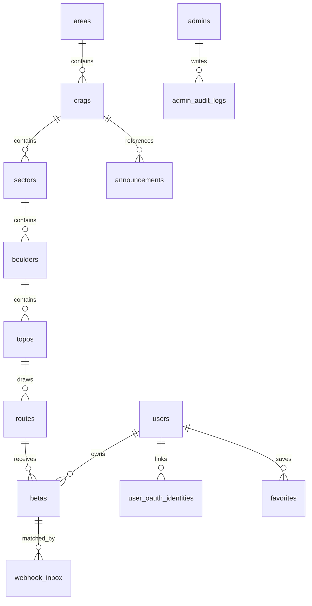

# Granite Data Model

> 작성일: 2026-05-28  
> 상태: Phase 2 기준 canonical model  
> 적용 범위: D1 schema, workbook import, public read model, future admin CRUD

Granite의 핵심 콘텐츠 모델은 `Area → Crag → Sector → Boulder → Topo → Route` 계층이다. 이 계층은 Phase 2 이후에도 public UI, admin CRUD, beta matching, favorites의 기준 구조로 유지한다.

## Principles

- 모든 slug는 lowercase `snake_case`를 사용한다.
- public URL 안정성을 위해 Boulder, Topo, Route 화면은 DB `id` 기반 링크를 우선 사용한다.
- slug는 운영자 식별과 import/update matching에 사용한다.
- D1에는 WGS84 좌표를 `REAL` 타입의 `lat`, `lng`로 저장한다.
- Boulder 좌표는 필수이고, Crag/Sector 좌표는 선택이다.
- 이미지는 polymorphic 테이블 없이 엔티티 컬럼에 직접 저장한다.
- 모든 콘텐츠 테이블은 공개 여부와 정렬을 위해 `is_published`, `sort_order`를 가진다.
- `is_published`는 애플리케이션에서는 boolean으로 다루지만, D1/SQLite에는 `INTEGER NOT NULL DEFAULT 0 CHECK (is_published IN (0, 1))` 형태로 저장한다.
- 이미지 컬럼에는 클라이언트가 사용할 CDN URL 또는 CDN 경로를 저장한다. R2 credential과 원본 private URL은 저장/노출하지 않는다.
- 외부 입력은 Zod 또는 import schema로 검증한 뒤 D1에 저장한다.

## ERD



## Content Tables

### `areas`

Top-level geographic grouping.

| Column | Type | Required | Notes |
|---|---:|:---:|---|
| `id` | `TEXT` | yes | Stable generated ID, e.g. `area_greater_seoul` |
| `name` | `TEXT` | yes | Korean display name |
| `name_en` | `TEXT` | no | English display name |
| `slug` | `TEXT` | yes | Unique lowercase snake_case |
| `cover_image_url` | `TEXT` | no | CDN URL/path; UI falls back to default image when empty |
| `is_published` | `INTEGER` | yes | `0` or `1` |
| `sort_order` | `INTEGER` | yes | Home ordering |
| `created_at` | `TEXT` | yes | DB timestamp |
| `updated_at` | `TEXT` | yes | DB timestamp |

### `crags`

Natural bouldering crag.

| Column | Type | Required | Notes |
|---|---:|:---:|---|
| `id` | `TEXT` | yes | Stable generated ID, e.g. `crag_anyang` |
| `area_id` | `TEXT` | yes | FK to `areas.id` |
| `name` | `TEXT` | yes | Korean display name |
| `name_en` | `TEXT` | no | English display name |
| `slug` | `TEXT` | yes | Unique lowercase snake_case |
| `lat` | `REAL` | no | Optional crag center |
| `lng` | `REAL` | no | Optional crag center |
| `description` | `TEXT` | yes | Hero/detail description, can be empty |
| `season` | `TEXT` | yes | Display season, can be empty |
| `cover_image_url` | `TEXT` | yes | CDN URL/path, can be empty during draft |
| `is_published` | `INTEGER` | yes | `0` or `1` |
| `sort_order` | `INTEGER` | yes | Area-local ordering |
| `created_at` | `TEXT` | yes | DB timestamp |
| `updated_at` | `TEXT` | yes | DB timestamp |

### `sectors`

Crag sub-area.

| Column | Type | Required | Notes |
|---|---:|:---:|---|
| `id` | `TEXT` | yes | Stable generated ID, e.g. `sector_anyang_antique` |
| `crag_id` | `TEXT` | yes | FK to `crags.id` |
| `name` | `TEXT` | yes | Korean display name |
| `name_en` | `TEXT` | no | English display name |
| `slug` | `TEXT` | yes | Unique per crag |
| `lat` | `REAL` | no | Optional sector center |
| `lng` | `REAL` | no | Optional sector center |
| `description` | `TEXT` | yes | Sector description, can be empty |
| `season` | `TEXT` | yes | Display season, can be empty |
| `cover_image_url` | `TEXT` | yes | CDN URL/path, can be empty during draft |
| `is_published` | `INTEGER` | yes | `0` or `1` |
| `sort_order` | `INTEGER` | yes | Crag-local ordering |
| `created_at` | `TEXT` | yes | DB timestamp |
| `updated_at` | `TEXT` | yes | DB timestamp |

Constraint: `UNIQUE(crag_id, slug)`.

### `boulders`

Individual boulder with required map coordinate.

| Column | Type | Required | Notes |
|---|---:|:---:|---|
| `id` | `TEXT` | yes | Stable generated ID, e.g. `boulder_gomul_boulder` |
| `sector_id` | `TEXT` | yes | FK to `sectors.id` |
| `name` | `TEXT` | yes | Display name |
| `slug` | `TEXT` | yes | Unique per sector |
| `lat` | `REAL` | yes | WGS84 latitude |
| `lng` | `REAL` | yes | WGS84 longitude |
| `hashtags` | `TEXT` | yes | JSON string array, e.g. `["안양", "고물"]` |
| `cover_image_url` | `TEXT` | yes | CDN URL/path, can be empty during draft |
| `is_published` | `INTEGER` | yes | `0` or `1` |
| `sort_order` | `INTEGER` | yes | Sector-local ordering |
| `created_at` | `TEXT` | yes | DB timestamp |
| `updated_at` | `TEXT` | yes | DB timestamp |

Constraint: `UNIQUE(sector_id, slug)`.

### `topos`

Topo image for a boulder face.

| Column | Type | Required | Notes |
|---|---:|:---:|---|
| `id` | `TEXT` | yes | Stable generated ID, e.g. `topo_gomul_boulder_1` |
| `boulder_id` | `TEXT` | yes | FK to `boulders.id` |
| `name` | `TEXT` | yes | Display name |
| `base_image_url` | `TEXT` | yes | CDN URL/path for base topo image |
| `is_published` | `INTEGER` | yes | `0` or `1` |
| `sort_order` | `INTEGER` | yes | Boulder-local ordering |
| `created_at` | `TEXT` | yes | DB timestamp |
| `updated_at` | `TEXT` | yes | DB timestamp |

### `routes`

Climbing route/problem drawn on a topo.

| Column | Type | Required | Notes |
|---|---:|:---:|---|
| `id` | `TEXT` | yes | Stable generated ID, e.g. `route_anaconda` |
| `topo_id` | `TEXT` | yes | FK to `topos.id` |
| `name` | `TEXT` | yes | Display name |
| `slug` | `TEXT` | yes | Unique per topo |
| `grade` | `TEXT` | yes | Display grade, e.g. `V10` |
| `grade_num` | `INTEGER` | yes | Numeric grade for sorting/filtering |
| `fa` | `TEXT` | yes | First ascent text, can be empty |
| `description` | `TEXT` | yes | Route notes, can be empty |
| `line_image_url` | `TEXT` | yes | CDN URL/path for selected line image, can be empty |
| `is_published` | `INTEGER` | yes | `0` or `1` |
| `sort_order` | `INTEGER` | yes | Topo-local route ordering |
| `created_at` | `TEXT` | yes | DB timestamp |
| `updated_at` | `TEXT` | yes | DB timestamp |

Constraint: `UNIQUE(topo_id, slug)`.

## Operational Tables

Phase 2 only needs public reads, but the schema reserves later phases.

### `announcements`

Public/admin announcement cards.

- `id`, `title`, `body`, `cover_image_url`, `crag_id`, `link_url`, `is_published`, `published_at`, `sort_order`, timestamps.

### `admins` and `admin_audit_logs`

Phase 3 admin authentication and mutation audit.

#### `admins`

| Column | Type | Required | Notes |
|---|---:|:---:|---|
| `id` | `TEXT` | yes | Stable generated ID |
| `email` | `TEXT` | yes | Unique login identifier |
| `password_hash` | `TEXT` | yes | Bcrypt hash |
| `display_name` | `TEXT` | yes | Admin display name |
| `is_active` | `INTEGER` | yes | `0` or `1`; soft deactivation |
| `created_at` | `TEXT` | yes | DB timestamp |
| `updated_at` | `TEXT` | yes | DB timestamp |

#### `admin_audit_logs`

| Column | Type | Required | Notes |
|---|---:|:---:|---|
| `id` | `TEXT` | yes | Stable generated ID |
| `admin_id` | `TEXT` | yes | FK to `admins.id` |
| `action` | `TEXT` | yes | e.g., `create`, `update`, `delete`, `restore` |
| `target_type` | `TEXT` | yes | e.g., `crag`, `boulder`, `route` |
| `target_id` | `TEXT` | yes | ID of the modified entity |
| `metadata` | `TEXT` | yes | JSON string with change details |
| `created_at` | `TEXT` | yes | DB timestamp |

**Admin operations notes:**

Phase 3 uses `admins.email` only for login lookup. JWT sessions use `admins.id` as the subject. `admin_audit_logs.metadata` stores compact JSON text with changed field names and optional before/after values; do not store passwords or secrets in metadata.

Content tables and `announcements` use `deleted_at` for soft delete. Public read queries must always exclude rows where `deleted_at IS NOT NULL`. Admin read queries include deleted rows by default and label them as deleted; restore actions set `deleted_at = NULL`.

### `users`, `user_oauth_identities`, `favorites`

Phase 6 user identity and saved projects.

- `users`: profile and soft-delete fields.
- `user_oauth_identities`: provider identity mapping.
- `favorites`: unique `user_id + target_type + target_id`; `target_type` is `crag`, `sector`, `boulder`, or `route`.

### `betas` and `webhook_inbox`

Phase 5 beta records and Instagram webhook processing.

- `betas.source`: `manual` or `instagram_webhook`.
- `betas.platform`: `instagram` or `youtube`.
- `betas.status`: `pending`, `approved`, `hidden`, or `removed`.
- `betas.claim_status`: `unclaimed`, `claimed`, `verified`, or `revoked`.
- `webhook_inbox.status`: `received`, `matched`, `unmatched`, `manual_matched`, or `rejected`.

## Image Model

Granite stores image references directly on entities:

- `crags.cover_image_url`
- `areas.cover_image_url`
- `sectors.cover_image_url`
- `boulders.cover_image_url`
- `topos.base_image_url`
- `routes.line_image_url`
- `announcements.cover_image_url`
- `betas.thumbnail_url`
- `betas.media_url`
- `users.avatar_url`

Source image handling:

- Original files are uploaded to R2.
- R2 object keys follow `{entityType}/{entityId}/{purpose}-{uuid}.{ext}`.
- Client-visible URLs use `CDN_BASE_URL`, normally `https://cdn.granite.kr`.
- `next/image` uses the Cloudflare image loader in `lib/r2/cloudflare-image-loader.ts` to request transformed images.
- During Phase 2 import, local `/images/...` paths may be accepted only for preview/migration validation. Production seed should store CDN URLs or CDN paths that can be transformed by the loader.

Phase 2 local image staging structure:

```text
docs/data/images/
├── areas/{area_slug}/cover.{ext}
├── crags/{crag_slug}/cover.{ext}
├── sectors/{sector_slug}/cover.{ext}
├── boulders/{boulder_slug}/cover.{ext}
├── topos/{topo_slug}/base.{ext}
├── routes/{route_slug}/line.{ext}
├── routes/unmapped/
└── misc/unmapped/
```

Workbook image URLs use the matching app-facing path:

- `/images/crags/{crag_slug}/cover.{ext}`
- `/images/areas/{area_slug}/cover.{ext}`
- `/images/sectors/{sector_slug}/cover.{ext}`
- `/images/boulders/{boulder_slug}/cover.{ext}`
- `/images/topos/{topo_slug}/base.{ext}`
- `/images/routes/{route_slug}/line.{ext}`

All staged image filenames and workbook image URLs must be ASCII-safe. Korean source filenames should be renamed to entity slug based paths before import.

## Workbook Mapping

The Phase 2 migration workbook is stored at:

`docs/data/granite-v2-migration-prep.xlsx`

Only these sheets are import sources:

- `Areas`
- `Crags`
- `Sectors`
- `Boulders`
- `Topos`
- `Routes`

Current cleaned counts:

| Sheet | Rows |
|---|---:|
| `Areas` | 5 |
| `Crags` | 6 |
| `Sectors` | 14 |
| `Boulders` | 31 |
| `Topos` | 50 |
| `Routes` | 97 |

Current local image references:

| Sheet | Referenced images |
|---|---:|
| `Areas` | 0 |
| `Crags` | 6 |
| `Sectors` | 0 |
| `Boulders` | 31 |
| `Topos` | 50 |
| `Routes` | 8 |

There are additional route-like files under `docs/data/images/routes/unmapped/`. They are intentionally excluded from import until each file is manually matched to a route.

Import ID convention:

| Entity | ID rule |
|---|---|
| Area | `area_${slug}` |
| Crag | `crag_${slug}` |
| Sector | `sector_${slug}` |
| Boulder | `boulder_${slug}` |
| Topo | `topo_${slug}` |
| Route | `route_${slug}` |

The import script must verify:

- every slug is lowercase snake_case;
- no duplicate generated IDs exist;
- every FK reference resolves;
- every Route references a valid Topo; Boulder context is derived through `routes.topo_id -> topos.boulder_id`;
- `boulders.hashtags` is valid JSON string array;
- `routes.grade_num` matches `routes.grade`;
- every content table row has `is_published` and `sort_order`;
- image columns contain either an approved local preview path or a production CDN URL/path.
- local preview image paths resolve under `docs/data/images/`;
- image paths and filenames are ASCII-safe and entity slug based.
