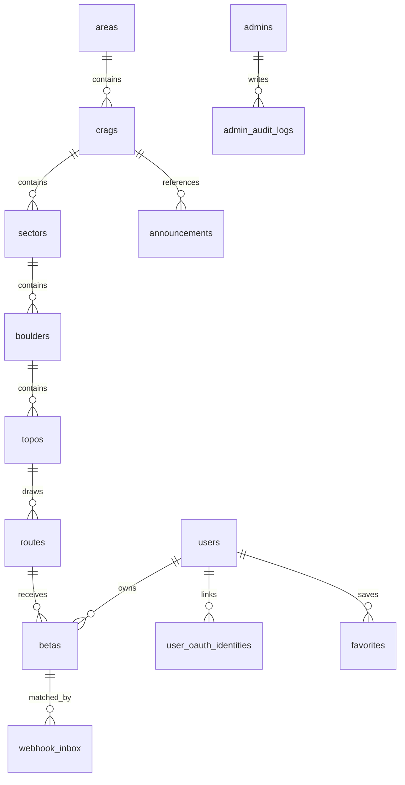

# Granite Data Model

> 작성일: 2026-05-28  
> 상태: Phase 2 기준 canonical model  
> 적용 범위: D1 schema, workbook import, public read model, future admin CRUD

Granite의 핵심 콘텐츠 모델은 `Area → Crag → Sector → Boulder → Topo → Route` 계층이다. 이 계층은 Phase 2 이후에도 public UI, admin CRUD, beta matching, favorites의 기준 구조로 유지한다.

## Principles

- 모든 slug는 lowercase `snake_case`를 사용한다.
- public URL 안정성을 위해 Boulder, Topo, Route 화면은 DB `id` 기반 링크를 우선 사용한다.
- slug는 운영자 식별과 import/update matching에 사용한다.
- D1에는 WGS84 좌표를 `REAL` 타입의 `lat`, `lng`로 저장한다.
- Boulder 좌표는 필수이고, Crag/Sector 좌표는 선택이다.
- 이미지는 polymorphic 테이블 없이 엔티티 컬럼에 직접 저장한다.
- 모든 콘텐츠 테이블은 공개 여부와 정렬을 위해 `is_published`, `sort_order`를 가진다.
- `is_published`는 애플리케이션에서는 boolean으로 다루지만, D1/SQLite에는 `INTEGER NOT NULL DEFAULT 0 CHECK (is_published IN (0, 1))` 형태로 저장한다.
- 이미지 컬럼에는 클라이언트가 사용할 CDN URL 또는 CDN 경로를 저장한다. R2 credential과 원본 private URL은 저장/노출하지 않는다.
- 외부 입력은 Zod 또는 import schema로 검증한 뒤 D1에 저장한다.

## ERD



## Content Tables

### `areas`

Top-level geographic grouping.

| Column | Type | Required | Notes |
|---|---:|:---:|---|
| `id` | `TEXT` | yes | Stable generated ID, e.g. `area_greater_seoul` |
| `name` | `TEXT` | yes | Korean display name |
| `name_en` | `TEXT` | no | English display name |
| `slug` | `TEXT` | yes | Unique lowercase snake_case |
| `cover_image_url` | `TEXT` | no | CDN URL/path; UI falls back to default image when empty |
| `is_published` | `INTEGER` | yes | `0` or `1` |
| `sort_order` | `INTEGER` | yes | Home ordering |
| `created_at` | `TEXT` | yes | DB timestamp |
| `updated_at` | `TEXT` | yes | DB timestamp |

### `crags`

Natural bouldering crag.

| Column | Type | Required | Notes |
|---|---:|:---:|---|
| `id` | `TEXT` | yes | Stable generated ID, e.g. `crag_anyang` |
| `area_id` | `TEXT` | yes | FK to `areas.id` |
| `name` | `TEXT` | yes | Korean display name |
| `name_en` | `TEXT` | no | English display name |
| `slug` | `TEXT` | yes | Unique lowercase snake_case |
| `lat` | `REAL` | no | Optional crag center |
| `lng` | `REAL` | no | Optional crag center |
| `description` | `TEXT` | yes | Hero/detail description, can be empty |
| `season` | `TEXT` | yes | Display season, can be empty |
| `cover_image_url` | `TEXT` | yes | CDN URL/path, can be empty during draft |
| `is_published` | `INTEGER` | yes | `0` or `1` |
| `sort_order` | `INTEGER` | yes | Area-local ordering |
| `created_at` | `TEXT` | yes | DB timestamp |
| `updated_at` | `TEXT` | yes | DB timestamp |

### `sectors`

Crag sub-area.

| Column | Type | Required | Notes |
|---|---:|:---:|---|
| `id` | `TEXT` | yes | Stable generated ID, e.g. `sector_anyang_antique` |
| `crag_id` | `TEXT` | yes | FK to `crags.id` |
| `name` | `TEXT` | yes | Korean display name |
| `name_en` | `TEXT` | no | English display name |
| `slug` | `TEXT` | yes | Unique per crag |
| `lat` | `REAL` | no | Optional sector center |
| `lng` | `REAL` | no | Optional sector center |
| `description` | `TEXT` | yes | Sector description, can be empty |
| `season` | `TEXT` | yes | Display season, can be empty |
| `cover_image_url` | `TEXT` | yes | CDN URL/path, can be empty during draft |
| `is_published` | `INTEGER` | yes | `0` or `1` |
| `sort_order` | `INTEGER` | yes | Crag-local ordering |
| `created_at` | `TEXT` | yes | DB timestamp |
| `updated_at` | `TEXT` | yes | DB timestamp |

Constraint: `UNIQUE(crag_id, slug)`.

### `boulders`

Individual boulder with required map coordinate.

| Column | Type | Required | Notes |
|---|---:|:---:|---|
| `id` | `TEXT` | yes | Stable generated ID, e.g. `boulder_gomul_boulder` |
| `sector_id` | `TEXT` | yes | FK to `sectors.id` |
| `name` | `TEXT` | yes | Display name |
| `slug` | `TEXT` | yes | Unique per sector |
| `lat` | `REAL` | yes | WGS84 latitude |
| `lng` | `REAL` | yes | WGS84 longitude |
| `hashtags` | `TEXT` | yes | JSON string array, e.g. `["안양", "고물"]` |
| `cover_image_url` | `TEXT` | yes | CDN URL/path, can be empty during draft |
| `is_published` | `INTEGER` | yes | `0` or `1` |
| `sort_order` | `INTEGER` | yes | Sector-local ordering |
| `created_at` | `TEXT` | yes | DB timestamp |
| `updated_at` | `TEXT` | yes | DB timestamp |

Constraint: `UNIQUE(sector_id, slug)`.

### `topos`

Topo image for a boulder face.

| Column | Type | Required | Notes |
|---|---:|:---:|---|
| `id` | `TEXT` | yes | Stable generated ID, e.g. `topo_gomul_boulder_1` |
| `boulder_id` | `TEXT` | yes | FK to `boulders.id` |
| `name` | `TEXT` | yes | Display name |
| `base_image_url` | `TEXT` | yes | CDN URL/path for base topo image |
| `is_published` | `INTEGER` | yes | `0` or `1` |
| `sort_order` | `INTEGER` | yes | Boulder-local ordering |
| `created_at` | `TEXT` | yes | DB timestamp |
| `updated_at` | `TEXT` | yes | DB timestamp |

### `routes`

Climbing route/problem drawn on a topo.

| Column | Type | Required | Notes |
|---|---:|:---:|---|
| `id` | `TEXT` | yes | Stable generated ID, e.g. `route_anaconda` |
| `topo_id` | `TEXT` | yes | FK to `topos.id` |
| `name` | `TEXT` | yes | Display name |
| `slug` | `TEXT` | yes | Unique per topo |
| `grade` | `TEXT` | yes | Display grade, e.g. `V10` |
| `grade_num` | `INTEGER` | yes | Numeric grade for sorting/filtering |
| `fa` | `TEXT` | yes | First ascent text, can be empty |
| `description` | `TEXT` | yes | Route notes, can be empty |
| `line_image_url` | `TEXT` | yes | CDN URL/path for selected line image, can be empty |
| `is_published` | `INTEGER` | yes | `0` or `1` |
| `sort_order` | `INTEGER` | yes | Topo-local route ordering |
| `created_at` | `TEXT` | yes | DB timestamp |
| `updated_at` | `TEXT` | yes | DB timestamp |

Constraint: `UNIQUE(topo_id, slug)`.

## Operational Tables

Phase 2 only needs public reads, but the schema reserves later phases.

### `announcements`

Public/admin announcement cards.

- `id`, `title`, `body`, `cover_image_url`, `crag_id`, `link_url`, `is_published`, `published_at`, `sort_order`, timestamps.

### `admins` and `admin_audit_logs`

Phase 3 admin authentication and mutation audit.

#### `admins`

| Column | Type | Required | Notes |
|---|---:|:---:|---|
| `id` | `TEXT` | yes | Stable generated ID |
| `email` | `TEXT` | yes | Unique login identifier |
| `password_hash` | `TEXT` | yes | Bcrypt hash |
| `display_name` | `TEXT` | yes | Admin display name |
| `is_active` | `INTEGER` | yes | `0` or `1`; soft deactivation |
| `created_at` | `TEXT` | yes | DB timestamp |
| `updated_at` | `TEXT` | yes | DB timestamp |

#### `admin_audit_logs`

| Column | Type | Required | Notes |
|---|---:|:---:|---|
| `id` | `TEXT` | yes | Stable generated ID |
| `admin_id` | `TEXT` | yes | FK to `admins.id` |
| `action` | `TEXT` | yes | e.g., `create`, `update`, `delete`, `restore` |
| `target_type` | `TEXT` | yes | e.g., `crag`, `boulder`, `route` |
| `target_id` | `TEXT` | yes | ID of the modified entity |
| `metadata` | `TEXT` | yes | JSON string with change details |
| `created_at` | `TEXT` | yes | DB timestamp |

**Admin operations notes:**

Phase 3 uses `admins.email` only for login lookup. JWT sessions use `admins.id` as the subject. `admin_audit_logs.metadata` stores compact JSON text with changed field names and optional before/after values; do not store passwords or secrets in metadata.

Content tables and `announcements` use `deleted_at` for soft delete. Public read queries must always exclude rows where `deleted_at IS NOT NULL`. Admin read queries include deleted rows by default and label them as deleted; restore actions set `deleted_at = NULL`.

### `users` and `user_oauth_identities`

Phase 6 user identity and social login provider mapping.

#### `users`

| Column | Type | Required | Notes |
|---|---:|:---:|---|
| `id` | `TEXT` | yes | Stable generated ID |
| `display_name` | `TEXT` | yes | User-facing profile name from OAuth or later profile edit |
| `email` | `TEXT` | no | Email from OAuth provider; nullable because providers may omit it |
| `avatar_url` | `TEXT` | no | OAuth profile image URL or later uploaded avatar URL |
| `instagram_id` | `TEXT` | no | User-entered Instagram handle for future unclaimed Beta claims |
| `youtube_id` | `TEXT` | no | User-entered YouTube channel ID or URL |
| `gender` | `TEXT` | no | Signup onboarding value: `male` or `female` |
| `height_cm` | `INTEGER` | no | Signup onboarding height in centimeters |
| `ape_index_cm` | `INTEGER` | no | Signup onboarding arm span in centimeters |
| `weight_kg` | `INTEGER` | no | Signup onboarding weight in kilograms (`migrations/0011_user_weight.sql`, Phase 9) |
| `top_bouldering_grade` | `TEXT` | no | Signup onboarding redpoint bouldering grade |
| `top_sport_grade` | `TEXT` | no | Signup onboarding Yosemite sport grade |
| `onboarding_completed_at` | `TEXT` | no | Timestamp set after first-time OAuth signup profile completion |
| `deleted_at` | `TEXT` | no | Soft delete marker for account withdrawal |
| `created_at` | `TEXT` | yes | DB timestamp |
| `updated_at` | `TEXT` | yes | DB timestamp |

Indexes:

- `idx_users_email` for future same-email merge discovery.
- `idx_users_deleted_at` for filtering active/deleted accounts.
- `idx_users_instagram_id` is unique for active, non-null Instagram handles only.

#### `user_oauth_identities`

| Column | Type | Required | Notes |
|---|---:|:---:|---|
| `id` | `TEXT` | yes | Stable generated ID |
| `user_id` | `TEXT` | yes | FK to `users.id`, cascade delete |
| `provider` | `TEXT` | yes | `kakao`, `naver`, `google`, or `apple` |
| `provider_uid` | `TEXT` | yes | Provider-specific stable user ID |
| `email_at_link` | `TEXT` | no | Email observed when linking the provider |
| `created_at` | `TEXT` | yes | DB timestamp |
| `updated_at` | `TEXT` | yes | DB timestamp |

Constraint: `UNIQUE(provider, provider_uid)`.

### `favorites`

Phase 8 saved projects (`migrations/0010_user_favorites.sql`).

| Column | Type | Required | Notes |
|---|---:|:---:|---|
| `id` | `TEXT` | yes | `fav_<uuid>` |
| `user_id` | `TEXT` | yes | FK → `users.id`, `ON DELETE CASCADE` |
| `target_type` | `TEXT` | yes | `CHECK (target_type IN ('route'))` — 다른 타입은 후속 migration으로 확장 |
| `target_id` | `TEXT` | yes | FK 없음(polymorphic); Server Action에서 published Route로 검증 |
| `created_at` | `TEXT` | yes | DB timestamp |

Constraints/indexes: `UNIQUE(user_id, target_type, target_id)`(중복 저장 방지, 자동 인덱스), `idx_favorites_user_created_at (user_id, created_at DESC)`(최신순 리스트), `idx_favorites_target (target_type, target_id)`(역조회 대비).

### `betas`

Phase 5 beta records and Instagram webhook processing. Every Phase 5 Beta has `user_id = NULL` and `claim_status='unclaimed'`.

| Column | Type | Required | Notes |
|---|---:|:---:|---|
| `id` | `TEXT` | yes | Stable generated ID |
| `route_id` | `TEXT` | yes | FK to `routes.id` |
| `user_id` | `TEXT` | no | Reserved for Phase 6 user claiming |
| `instagram_id` | `TEXT` | yes | Instagram handle, e.g. `@climber_name` |
| `display_name` | `TEXT` | yes | User display name from Instagram or manual entry |
| `source` | `TEXT` | yes | `manual` or `instagram_webhook` |
| `platform` | `TEXT` | yes | `instagram` or `youtube` |
| `media_url` | `TEXT` | yes | CDN or external URL to media asset |
| `permalink_url` | `TEXT` | no | External link to Instagram post or YouTube video |
| `external_media_id` | `TEXT` | no | Instagram media ID or YouTube video ID |
| `thumbnail_url` | `TEXT` | no | CDN URL to cached thumbnail |
| `sent_at` | `TEXT` | yes | ISO timestamp when climber posted original content |
| `status` | `TEXT` | yes | `pending`, `approved`, `hidden`, or `removed` |
| `claim_status` | `TEXT` | yes | `unclaimed`, `claimed`, `verified`, or `revoked` |
| `moderation_note` | `TEXT` | yes | Admin note, can be empty |
| `created_at` | `TEXT` | yes | DB timestamp |
| `updated_at` | `TEXT` | yes | DB timestamp |
| `deleted_at` | `TEXT` | no | Soft-delete marker |

Constraints:
- `UNIQUE(platform, external_media_id) WHERE external_media_id IS NOT NULL AND deleted_at IS NULL`
- `UNIQUE(platform, permalink_url) WHERE permalink_url IS NOT NULL AND deleted_at IS NULL`

### `webhook_inbox`

Instagram webhook ingestion log. Tracks incoming webhook payloads for matching, retry, and debugging.

| Column | Type | Required | Notes |
|---|---:|:---:|---|
| `id` | `TEXT` | yes | Stable generated ID |
| `provider` | `TEXT` | yes | Always `instagram` |
| `external_id` | `TEXT` | yes | Unique external event ID from provider |
| `external_media_id` | `TEXT` | no | Canonical Instagram `media_id`. For caption mentions equals `external_id`; for comment mentions equals the parent `media_id` while `external_id` remains the `comment_id` idempotency key. Used by admin manual matching for duplicate detection against `betas.external_media_id`. Nullable for rows created before migration `0005`. |
| `ig_user_id` | `TEXT` | yes | Instagram user ID, can be empty during parse |
| `ig_username` | `TEXT` | yes | Instagram handle, can be empty during parse |
| `caption` | `TEXT` | yes | Post caption text, can be empty |
| `media_url` | `TEXT` | yes | Original media URL from webhook, can be empty |
| `thumbnail_url` | `TEXT` | no | Cached CDN thumbnail URL |
| `matched_beta_id` | `TEXT` | no | FK to `betas.id` if matched |
| `status` | `TEXT` | yes | `received`, `processing`, `matched`, `unmatched`, `manual_matched`, `rejected`, `duplicate`, or `failed` |
| `processing_attempts` | `INTEGER` | yes | Retry counter, default 0 |
| `last_error_code` | `TEXT` | yes | Error code from last processing attempt, can be empty |
| `last_error_message` | `TEXT` | yes | Error message from last processing attempt, can be empty |
| `raw_payload` | `TEXT` | yes | Full JSON webhook payload |
| `received_at` | `TEXT` | yes | DB timestamp when webhook arrived |
| `updated_at` | `TEXT` | yes | DB timestamp of last status change |

Constraint: `external_id` is UNIQUE.

### `webhook_operational_events`

Diagnostic and operational event log for webhook processing, caption parsing, and route matching.

| Column | Type | Required | Notes |
|---|---:|:---:|---|
| `id` | `TEXT` | yes | Stable generated ID |
| `event_type` | `TEXT` | yes | `invalid_signature`, `graph_api_failure`, `caption_parse_failed`, `route_match_ambiguous`, `duplicate_beta`, `thumbnail_lookup_failed`, or `thumbnail_copy_failed` |
| `provider` | `TEXT` | yes | Always `instagram` |
| `webhook_id` | `TEXT` | no | FK to `webhook_inbox.id` for context |
| `beta_id` | `TEXT` | no | FK to `betas.id` for context |
| `request_id` | `TEXT` | yes | Request correlation ID, can be empty |
| `method` | `TEXT` | yes | HTTP method, can be empty |
| `path` | `TEXT` | yes | HTTP path, can be empty |
| `status_code` | `INTEGER` | no | HTTP response status, if applicable |
| `message` | `TEXT` | yes | Human-readable event description, can be empty |
| `metadata` | `TEXT` | yes | JSON object with event-specific context, default `{}` |
| `created_at` | `TEXT` | yes | DB timestamp |

## Image Model

Granite stores image references directly on entities:

- `crags.cover_image_url`
- `areas.cover_image_url`
- `sectors.cover_image_url`
- `boulders.cover_image_url`
- `topos.base_image_url`
- `routes.line_image_url`
- `announcements.cover_image_url`
- `betas.thumbnail_url`
- `betas.media_url`
- `users.avatar_url`

Source image handling:

- Original files are uploaded to R2.
- R2 object keys follow `{entityType}/{entityId}/{purpose}-{uuid}.{ext}`.
- Client-visible URLs use `CDN_BASE_URL`, normally `https://cdn.granite.kr`.
- `next/image` uses the Cloudflare image loader in `lib/r2/cloudflare-image-loader.ts` to request transformed images.
- During Phase 2 import, local `/images/...` paths may be accepted only for preview/migration validation. Production seed should store CDN URLs or CDN paths that can be transformed by the loader.

Phase 2 local image staging structure:

```text
docs/data/images/
├── areas/{area_slug}/cover.{ext}
├── crags/{crag_slug}/cover.{ext}
├── sectors/{sector_slug}/cover.{ext}
├── boulders/{boulder_slug}/cover.{ext}
├── topos/{topo_slug}/base.{ext}
├── routes/{route_slug}/line.{ext}
├── routes/unmapped/
└── misc/unmapped/
```

Workbook image URLs use the matching app-facing path:

- `/images/crags/{crag_slug}/cover.{ext}`
- `/images/areas/{area_slug}/cover.{ext}`
- `/images/sectors/{sector_slug}/cover.{ext}`
- `/images/boulders/{boulder_slug}/cover.{ext}`
- `/images/topos/{topo_slug}/base.{ext}`
- `/images/routes/{route_slug}/line.{ext}`

All staged image filenames and workbook image URLs must be ASCII-safe. Korean source filenames should be renamed to entity slug based paths before import.

## Workbook Mapping

The Phase 2 migration workbook is stored at:

`docs/data/granite-v2-migration-prep.xlsx`

Only these sheets are import sources:

- `Areas`
- `Crags`
- `Sectors`
- `Boulders`
- `Topos`
- `Routes`

Current cleaned counts:

| Sheet | Rows |
|---|---:|
| `Areas` | 5 |
| `Crags` | 6 |
| `Sectors` | 14 |
| `Boulders` | 31 |
| `Topos` | 50 |
| `Routes` | 97 |

Current local image references:

| Sheet | Referenced images |
|---|---:|
| `Areas` | 0 |
| `Crags` | 6 |
| `Sectors` | 0 |
| `Boulders` | 31 |
| `Topos` | 50 |
| `Routes` | 8 |

There are additional route-like files under `docs/data/images/routes/unmapped/`. They are intentionally excluded from import until each file is manually matched to a route.

Import ID convention:

| Entity | ID rule |
|---|---|
| Area | `area_${slug}` |
| Crag | `crag_${slug}` |
| Sector | `sector_${slug}` |
| Boulder | `boulder_${slug}` |
| Topo | `topo_${slug}` |
| Route | `route_${slug}` |

The import script must verify:

- every slug is lowercase snake_case;
- no duplicate generated IDs exist;
- every FK reference resolves;
- every Route references a valid Topo; Boulder context is derived through `routes.topo_id -> topos.boulder_id`;
- `boulders.hashtags` is valid JSON string array;
- `routes.grade_num` matches `routes.grade`;
- every content table row has `is_published` and `sort_order`;
- image columns contain either an approved local preview path or a production CDN URL/path.
- local preview image paths resolve under `docs/data/images/`;
- image paths and filenames are ASCII-safe and entity slug based.
