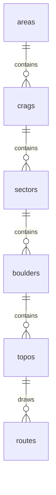

# Granite Phase 2 DB Migration & Data Layer Implementation Plan

> **For agentic workers:** REQUIRED SUB-SKILL: Use superpowers:subagent-driven-development (recommended) or superpowers:executing-plans to implement this plan task-by-task. Steps use checkbox (`- [ ]`) syntax for tracking.

**Goal:** Move the Phase 1 public UI from mock JSON data to Cloudflare D1-backed public read paths using the prepared migration workbook.

**Architecture:** Keep all SQL and D1 HTTP access inside `lib/db/`. Convert the existing synchronous repository surface into cached async query functions consumed by Server Components. Treat the Excel workbook as a source import artifact, not as runtime data. Store image references on entity columns and normalize production imports to CDN URLs or CDN paths backed by R2.

**Tech Stack:** Next.js App Router, Server Components, TypeScript strict, Cloudflare D1 HTTP API, SQLite migrations, `unstable_cache`, Vitest, bundled spreadsheet tooling.

---

## Current Context

- Source workbook: `docs/data/granite-v2-migration-prep.xlsx`
- Workbook has been cleaned to import-only sheets:
  - `Areas`: 5 rows
  - `Crags`: 6 rows
  - `Sectors`: 14 rows
  - `Boulders`: 31 rows
  - `Topos`: 50 rows
  - `Routes`: 97 rows
- Removed non-import sheets: `README`, `Summary`, `Issues`.
- Automatic cleanup already applied:
  - all slug/ref columns are lowercase `snake_case`;
  - blank/sample rows were removed;
  - `Routes.boulder_slug (auto)` is retained only as an import validation aid; persisted Route rows should reference Topo only.
  - duplicate generated slug checks pass;
  - sector/boulder/topo/route reference checks pass.
- Local image cleanup already applied:
  - staged images live under `docs/data/images/{entity}/{slug}/`;
  - workbook image URLs were updated to app-facing `/images/{entity}/{slug}/{purpose}.{ext}` paths;
  - Korean source filenames were replaced with slug-based ASCII-safe paths;
  - current image references: Areas 0, Crags 6, Sectors 0, Boulders 31, Topos 50, Routes 8;
  - 25 route-like images remain under `docs/data/images/routes/unmapped/` and require manual route matching before import.
- Existing Phase 1 migration files have been removed. Phase 2 should create fresh migrations from the canonical data model and cleaned workbook.
- Existing public data boundary: `lib/db/repository.ts`
- Existing mock source: `lib/db/mock/granite.seed.json`
- Current `/healthz`: only checks environment variable presence, not D1 connectivity.
- Canonical data model: `docs/DATA_MODEL.md`

## Required Decisions Before Import

- Confirm whether current `Sectors` rows are final production sectors or temporary migration groupings.
- Review semantic changes from automatic cleanup:
  - `hyunchung_boulder_*` topos now attach routes to `memorial_boulder`;
  - `Fat Cat` currently attaches to `fatboy_boulder_1`, so it imports under `fatboy_boulder`;
  - route slug `3m` starts with a number. It is valid snake_case, but URL/import policy must explicitly allow numeric-leading slugs.
- Fill or approve defaults for empty `description`, `season`, and image URL columns.
- Align the workbook to the updated data model:
  - add `Areas.cover_image_url` and `Areas.is_published`;
  - add or derive `sort_order` for Boulders, Topos, and Routes where missing;
  - add `is_published` for Topos if it is not present in the workbook;
  - map existing English-name columns to `name_en`.
- Decide image URL policy per environment:
  - local/preview import may keep local `/images/...` values for UI validation;
  - production import should use `https://cdn.granite.kr/...` or a CDN path that the Cloudflare image loader can transform.
- Manually review `docs/data/images/routes/unmapped/` and attach any valid route line images to `Routes.line_image_url (TO FILL)`.
- Confirm route link stability:
  - Phase 1 currently uses route IDs and topo IDs in URLs.
  - Workbook provides slugs. The import will generate stable IDs using `docs/DATA_MODEL.md` rules, for example `route_${slug}`.

## Data Model

The stable data model is documented separately in `docs/DATA_MODEL.md`. Phase 2 implementation must follow that document unless a new ADR changes it.

### Content Hierarchy



### Import ID Rules

| Entity | ID rule |
|---|---|
| Area | `area_${slug}` |
| Crag | `crag_${slug}` |
| Sector | `sector_${slug}` |
| Boulder | `boulder_${slug}` |
| Topo | `topo_${slug}` |
| Route | `route_${slug}` |

### Phase 2 Content Tables

- `areas`: `id`, `name`, `name_en`, `slug`, `cover_image_url`, `is_published`, `sort_order`
- `crags`: `id`, `area_id`, `name`, `name_en`, `slug`, `lat`, `lng`, `description`, `season`, `cover_image_url`, `is_published`, `sort_order`
- `sectors`: `id`, `crag_id`, `name`, `name_en`, `slug`, `lat`, `lng`, `description`, `season`, `cover_image_url`, `is_published`, `sort_order`
- `boulders`: `id`, `sector_id`, `name`, `slug`, `lat`, `lng`, `hashtags`, `cover_image_url`, `is_published`, `sort_order`
- `topos`: `id`, `boulder_id`, `name`, `base_image_url`, `is_published`, `sort_order`
- `routes`: `id`, `topo_id`, `name`, `slug`, `grade`, `grade_num`, `fa`, `description`, `line_image_url`, `is_published`, `sort_order`

`is_published` is an application boolean, but D1/SQLite should store it as `INTEGER NOT NULL DEFAULT 0 CHECK (is_published IN (0, 1))`.

### Image Columns

- `crags.cover_image_url`
- `areas.cover_image_url`
- `sectors.cover_image_url`
- `boulders.cover_image_url`
- `topos.base_image_url`
- `routes.line_image_url`

No image metadata or polymorphic image table is part of Phase 2.

### Local Image Staging

```text
docs/data/images/
├── areas/{area_slug}/cover.{ext}
├── crags/{crag_slug}/cover.{ext}
├── sectors/{sector_slug}/cover.{ext}
├── boulders/{boulder_slug}/cover.{ext}
├── topos/{topo_slug}/base.{ext}
├── routes/{route_slug}/line.{ext}
├── routes/unmapped/
└── misc/unmapped/
```

Workbook image URLs must point to `/images/...` paths matching this structure for preview import. Production import must replace or transform these to CDN-backed values.

## File Map

- `docs/plans/2026-05-28-granite-phase-2.md`: this execution plan.
- `docs/DATA_MODEL.md`: canonical data model used by migrations, imports, and repository queries.
- `docs/data/granite-v2-migration-prep.xlsx`: cleaned workbook import source.
- `docs/data/granite-v2-import-notes.md`: data cleanup notes, slug policy, image policy, and workbook issue resolution log.
- `scripts/import-content-workbook.ts`: reads the workbook and emits validated SQL/JSON import artifacts.
- `scripts/prepare-content-images.ts`: optional Phase 2 image helper that maps supplied image files to R2 keys/CDN URLs before SQL generation.
- `lib/db/import-schema.ts`: Zod schemas for workbook/import rows.
- `lib/db/import-normalize.ts`: slug, grade, boolean, JSON, and ID normalization helpers.
- `lib/db/import-normalize.test.ts`: unit tests for normalization edge cases.
- `lib/r2/images.ts`: existing R2 key/CDN helper surface to reuse for image URL normalization.
- `lib/r2/cloudflare-image-loader.ts`: existing Cloudflare Image Resizing loader; verify imported URLs are compatible.
- `migrations/0001_*.sql`: Phase 2 implementation should create the fresh schema migration from `docs/DATA_MODEL.md`.
- `migrations/0002_*.sql`: Phase 2 implementation should create the fresh import migration from `docs/data/granite-v2-migration-prep.xlsx`.
- `lib/db/d1-http.ts`: D1 HTTP API client with typed query helpers.
- `lib/db/queries.ts`: SQL read functions that return typed rows.
- `lib/db/repository.ts`: async public repository API backed by D1 queries and `unstable_cache`.
- `lib/db/repository.test.ts`: repository tests updated to use a deterministic query adapter or fixture DB rows.
- `app/(public)/page.tsx`: await `getHomeModel()`.
- `app/c/[cragSlug]/page.tsx`: await `findCragBySlug()`.
- `app/topos/[topoId]/page.tsx`: await `findTopoById()`.
- `app/r/[routeId]/page.tsx`: await `findRouteById()`.
- `app/healthz/route.ts`: perform a real D1 ping.
- `.env.example`: align D1 env names with AGENTS.md (`D1_HTTP_URL`, `D1_API_TOKEN`, `D1_DATABASE_ID`) or document the existing Cloudflare names.

## Task 1: Data Cleanup Contract

- [x] Create `docs/data/granite-v2-import-notes.md`.
- [x] Record the final slug convention and ID generation rule.
- [x] Record the cleaned workbook path: `docs/data/granite-v2-migration-prep.xlsx`.
- [x] Record the current clean counts: Areas 5, Crags 6, Sectors 14, Boulders 31, Topos 50, Routes 97.
- [x] Record the remaining semantic review items:
  - `hyunchung_boulder_*` topos attach to `memorial_boulder`;
  - `Fat Cat` attaches to `fatboy_boulder_1`;
  - `3m` starts with a number.
- [x] List unresolved optional display fields that may remain empty for preview.
- [x] Record required schema/model changes from the current Phase 1 schema:
  - add `name_en` to `areas`, `crags`, and `sectors`;
  - add `cover_image_url` and `is_published` to `areas`;
  - rename `summary` to `description` on `crags` and `sectors`;
  - remove `access_desc` and `parking_desc` from `crags` and `sectors`;
  - remove `coord_precision` and `rock_type` from `boulders`;
  - add `is_published` and `sort_order` to every content table.
- [x] Record image URL policy:
  - local/preview may use local `/images/...` paths;
  - production must use CDN URLs or CDN paths derived from uploaded R2 objects.
- [x] Record current local image staging status:
  - Areas 0 referenced images;
  - Crags 6 referenced images;
  - Boulders 31 referenced images;
  - Topos 50 referenced images;
  - Routes 8 referenced images;
  - 25 route images still unmapped.

## Task 2: Import Validation Helpers

- [x] Add `lib/db/import-normalize.ts` with pure helpers:
  - `normalizeSlug(input: string): string`
  - `buildId(prefix: string, slug: string): string`
  - `parseBooleanCell(value: unknown): boolean`
  - `parseGradeNum(grade: string): number`
  - `parseHashtagsJson(value: unknown): string`
- [x] Add tests in `lib/db/import-normalize.test.ts` for:
  - spaces and mixed case in slugs
  - `V0`, `V10`, and invalid grades
  - boolean cells from `True`, `False`, `1`, `0`
  - empty hashtag cells defaulting to `[]`
  - numeric-leading route slugs such as `3m`
  - ID generation using underscores, e.g. `route_anaconda`
- [x] Run:

```bash
pnpm test lib/db/import-normalize.test.ts
```

Expected: tests pass.

## Task 3: Workbook Import Script

- [x] Add `lib/db/import-schema.ts` with Zod schemas for workbook-derived Area, Crag, Sector, Boulder, Topo, and Route rows.
- [x] Add `scripts/import-content-workbook.ts`.
- [x] Script behavior:
  - input: workbook path
  - output: SQL insert file
  - fail fast on missing foreign keys
  - fail fast on duplicate generated IDs
  - fail fast when a slug is not lowercase `snake_case`
  - fail fast when `routes.topo_slug` does not resolve to a Topo
  - use workbook `Routes.boulder_slug (auto)` only as a validation aid; do not persist `routes.boulder_id`
  - fail fast on unresolved required fields
  - derive or validate `name_en`, `is_published`, and `sort_order` for every content entity according to `docs/DATA_MODEL.md`
  - map workbook legacy column names to current model names, for example `summary`/`description` source columns to `description`
  - allow optional public fields to default to empty string only if documented in import notes
  - validate image columns according to the selected image policy
- [x] Generate the import SQL artifact after the fresh schema migration exists:

```bash
pnpm tsx scripts/import-content-workbook.ts docs/data/granite-v2-migration-prep.xlsx migrations/0002_import_v1_content.sql
```

If `tsx` is not available, add the minimal dev dependency or run through the existing TypeScript-compatible project toolchain.

## Task 4: Schema Migration Strategy

- [x] Create a fresh initial schema migration at implementation time, expected path: `migrations/0001_init.sql`.
- [x] Use `docs/DATA_MODEL.md` as the source of truth for the target schema.
- [x] Use `docs/data/granite-v2-migration-prep.xlsx` to confirm which workbook fields map to each model field.
- [x] Align existing content tables with `docs/DATA_MODEL.md`:
  - `areas`: add `name_en`, `cover_image_url`, `is_published`;
  - `crags`: add `name_en`, `description`, `sort_order`; remove runtime dependency on `summary`, `access_desc`, `parking_desc`;
  - `sectors`: add `name_en`, `description`, `sort_order`; remove runtime dependency on `summary`, `access_desc`, `parking_desc`;
  - `boulders`: add `sort_order`; remove runtime dependency on `coord_precision`, `rock_type`;
  - `topos`: add `is_published`;
  - `routes`: add `sort_order`; do not include `boulder_id` because Boulder context is derived through Topo.
- [x] Because D1/SQLite column drops can be disruptive, prefer a roll-forward table rebuild migration when removing columns is required. If removal is deferred, keep old columns unused and document the compatibility window in `docs/data/granite-v2-import-notes.md`.
- [x] Update `lib/db/schema.ts` to match the new model.

## Task 5: Import Migration Strategy

- [x] Create the import migration after the schema migration, expected path: `migrations/0002_import_v1_content.sql`.
- [x] Generate the import SQL from `docs/data/granite-v2-migration-prep.xlsx` after schema alignment is defined.
- [x] Decide whether the generated import migration replaces mock data or coexists.
- [x] Recommended local/preview path:
  - create fresh `0001_init.sql` from `docs/DATA_MODEL.md`
  - create fresh `0002_import_v1_content.sql` from `docs/data/granite-v2-migration-prep.xlsx`
  - for fresh local DBs, apply all migrations
- [x] Recommended production path:
  - apply schema migrations first
  - apply import seed once
  - do not rerun destructive seed scripts against production
- [x] Verify generated SQL uses parameter-safe escaped values and stable insert ordering:
  - `areas`
  - `crags`
  - `sectors`
  - `boulders`
  - `topos`
  - `routes`
  - optional `announcements`

## Task 6: Image CDN Import Path

- [x] Confirm whether Phase 2 production images will be supplied as staged local files, existing R2 keys, or existing CDN URLs.
- [x] Use `docs/data/images/` as the local staging root.
- [x] Validate the staged structure:
  - `areas/{area_slug}/cover.{ext}`;
  - `crags/{crag_slug}/cover.{ext}`;
  - `sectors/{sector_slug}/cover.{ext}`;
  - `boulders/{boulder_slug}/cover.{ext}`;
  - `topos/{topo_slug}/base.{ext}`;
  - `routes/{route_slug}/line.{ext}`.
- [x] Validate every workbook image URL resolves to a staged local file for preview imports.
- [x] Validate every workbook image URL and staged filename is ASCII-safe.
- [x] Keep `docs/data/images/routes/unmapped/` out of generated SQL unless a file is manually matched to a `Routes.slug`.
- [x] If local image files are supplied, add `scripts/prepare-content-images.ts` to:
  - read an image manifest keyed by workbook entity and purpose;
  - validate file existence, MIME type, and extension;
  - generate R2 keys using `{entityType}/{entityId}/{purpose}-{uuid}.{ext}`;
  - output a workbook update manifest containing CDN URLs;
  - leave EXIF stripping/upload execution to the existing R2 helper or a follow-up upload command if the helper is not ready.
- [x] If existing CDN URLs are supplied, update the workbook image columns directly and validate:
  - `crags.cover_image_url`;
  - `sectors.cover_image_url`;
  - `boulders.cover_image_url`;
  - `topos.base_image_url`;
  - `routes.line_image_url`.
- [x] Ensure production import does not store private R2 URLs, signed URLs, or raw S3 endpoint URLs.
- [x] Verify `lib/r2/cloudflare-image-loader.ts` can transform the resulting URLs.
- [x] Keep image metadata out of the D1 schema for Phase 2.

## Task 7: D1 HTTP Client

- [x] Add `lib/db/d1-http.ts`.
- [x] Use environment variables:
  - `D1_HTTP_URL`
  - `D1_API_TOKEN`
  - `D1_DATABASE_ID`
- [x] Export a small query interface:
  - `queryD1<T>(sql: string, params?: unknown[]): Promise<T[]>`
  - `queryD1First<T>(sql: string, params?: unknown[]): Promise<T | null>`
  - `pingD1(): Promise<boolean>`
- [x] Keep this file server-only. Do not import it into Client Components.
- [x] Add tests with `fetch` mocked so no network call is required.

## Task 8: Typed Public Queries

- [x] Add `lib/db/queries.ts`.
- [x] Implement SQL functions for the existing repository needs:
  - home totals
  - areas with published crags
  - announcements
  - crag by slug
  - crag sectors
  - crag boulders with route counts and grade ranges
  - crag routes with hierarchy names
  - topo by ID with boulder/sector/crag hierarchy
  - route by ID
- [x] Keep row-shaping close to `lib/db/schema.ts` types.
- [x] Update row-shaping to use `description` instead of `summary`.
- [x] Do not depend on removed `access_desc`, `parking_desc`, `coord_precision`, or `rock_type` fields.
- [x] Join Route hierarchy through `routes.topo_id -> topos.boulder_id -> boulders.sector_id -> sectors.crag_id`.
- [x] Use parameter binding for every dynamic value.

## Task 9: Async Cached Repository

- [x] Convert `lib/db/repository.ts` functions to async:
  - `getHomeModel(): Promise<HomeModel>`
  - `findCragBySlug(slug: string): Promise<CragDetail | null>`
  - `findSectorBySlug(cragSlug: string, sectorSlug: string): Promise<SectorDetail | null>`
  - `findBoulderById(id: string): Promise<BoulderDetail | null>`
  - `findTopoById(id: string): Promise<TopoDetail | null>`
  - `findRouteById(id: string): Promise<RouteListItem | null>`
- [x] Wrap public reads with `unstable_cache`.
- [x] Use tags from AGENTS.md:
  - `home`
  - `areas:list`
  - `crag:<id>`
  - `sector:<id>`
  - `boulder:<id>`
  - `route:<id>`
- [x] Preserve `parseBoulderHashtags()` and its defensive behavior.

## Task 10: Public UI Async Conversion

- [x] Update `app/(public)/page.tsx` to `await getHomeModel()`.
- [x] Update `app/c/[cragSlug]/page.tsx` to `await findCragBySlug()`.
- [x] Update `app/topos/[topoId]/page.tsx` to `await findTopoById()`.
- [x] Update `app/r/[routeId]/page.tsx` to `await findRouteById()`.
- [x] Confirm no Client Component imports `lib/db/d1-http.ts`.

## Task 11: Health Check

- [x] Update `app/healthz/route.ts`.
- [x] Return JSON with:
  - `checks.app`
  - `checks.db`
  - optional timing in milliseconds
- [x] Call `pingD1()` using `SELECT 1`.
- [x] Return HTTP 200 when DB is reachable.
- [x] Return HTTP 503 when DB is configured but unreachable.
- [x] Return a clear `not_configured` state locally when env vars are absent.

## Task 12: Verification

- [x] Run unit tests:

```bash
pnpm test
```

- [x] Run typecheck:

```bash
pnpm typecheck
```

- [x] Run build:

```bash
pnpm build
```

- [x] Apply migrations to local D1:

```bash
pnpm wrangler d1 migrations apply granite --local
```

- [x] Start the app:

```bash
pnpm dev
```

- [x] Manually verify:
  - `/`
  - `/c/anyang`
  - `/topos/<known-topo-id>`
  - `/r/<known-route-id>`
  - `/healthz`
- [x] Manually verify representative images:
  - home/crag card image renders;
  - crag hero image renders;
  - boulder card image renders;
  - topo base image renders;
  - selected route line image falls back to topo base image when `line_image_url` is empty.

## Main Risks

- Semantic workbook mismatches can pass FK validation if the topo/boulder mapping is internally consistent but operationally wrong.
- Workbook currently has temporary or empty display/image fields; importing too early may make the UI look incomplete even if the DB layer works.
- D1 HTTP response shape and errors must be normalized in `lib/db/d1-http.ts`; leaking raw Cloudflare payloads upward will make repository tests brittle.
- Existing repository tests assume synchronous mock arrays and exact mock counts. They must be rewritten around async DB-backed behavior.
- CDN/R2 image migration is not fully solved unless production image files, R2 keys, or CDN URLs are supplied before production seed.
